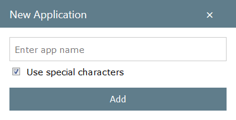
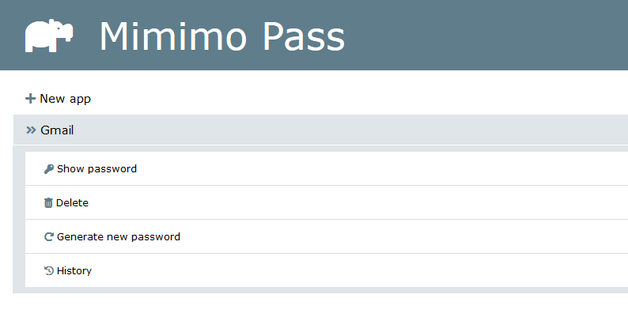
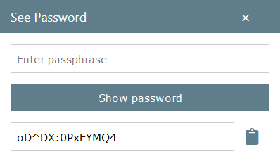

# Mimimo Pass

Mimimo Pass is a password manager that works without having to store any password.  
It is a web application, running on local host

> This is the first version, following functionnalities are yet to be added :
> * Add more custom settings for the generated password (Length, disable specific characters...)
> * Store the login
> * Improve the layout
> * ...

## How does it work ?


How can it remember your passwords if it doesn't store anything ?  
The thing is, it does not have to remember because it generates them every time you need them.  
The generation algorithm is deterministic :  
Given 1 master password, 1 application name and 1 version number, the generated password will always be the same.  
(The version number is just an increment, starting from 0 and incremented everytime you click on "Generate new password")  
All you have to do is remember one master password, and type it everytime you need a password.


## Install

```bash
git clone https://github.com/Pykselle/MimimoPass.git 
cd MimimoPass
go build && ./MimimoPass
```
Then go to http://localhost:8080/

###  First use

If you launch it for the 1st time, you will see this :  


* Click on "New app" to add a new application ([Go here for more informations](#Add-a-new-application))

* Then click on "Show password" ([Go here for more informations](#Get-the-password-of-an-application))

Now you can log in to the application, and change the password to use the one generated by MimimoPass.  

### Use mimimo pass on another desktop

If you want to use it on another desktop, you can follow this procedure :

* Go in the MimimoPass directory (on the machine where it is allready installed)
* Copy the "app" directory
* Install MimimoPass on your other machine
* Add the "app" directory you copied

And *Tadaamm* ! You should see all your applications !

## Functionnalities

### Add a new application

You can add a new application by clicking on "+ New app"

Enter the name of the application (Gmail, Facebook, Twitter...



Congratulations ! You've just added your first application !



### Get the password of an application

* Click on one application
* Click on "Show password"
* Enter your master password
* Click on "Show password"



The password is displayed, and copied to the clipboard if you click on the clickboard icon

### Delete an application

* Click on one application
* Click on "Delete"
* You'll have to confirm that you want to delete this application

> If you delete an application, you will not be able to see the password again, unless you re-create the application with the same name, and you generate the same number of password (The password is generated from a hash of the app name, the master password and the incrementation number)

### Change the password of an application

* Click on one application
* Click on "Generate new password"

The version number is incremented => A brand new password will be generated if you click on "Show password"  
The history is automatically opened, allowing you to see the old and the new password 

### Get the previous passwords of an application

* Click on one application
* Click on "History"
* Enter your master password
* Click on "Show history"

(As explained in the introduction, MimimoPass does not store the passwords but is able to re-generate them)

")


